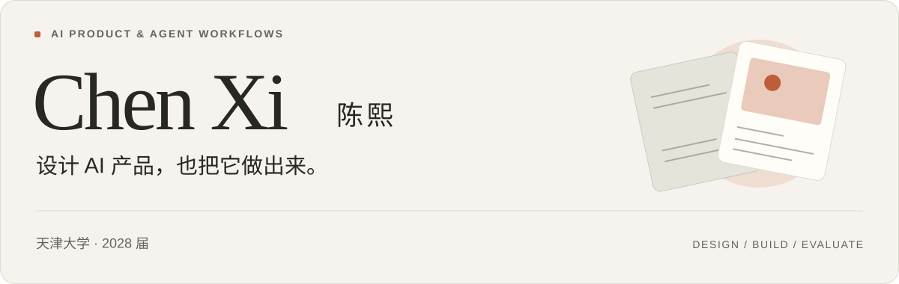

<picture>
  <source media="(max-width: 600px) and (prefers-color-scheme: dark)" srcset="assets/intro-mobile-dark.svg" />
  <source media="(max-width: 600px)" srcset="assets/intro-mobile-light.svg" />
  <source media="(prefers-color-scheme: dark)" srcset="assets/intro-dark.svg" />
  
</picture>

天津大学本科在读，**2028 届**。有滴滴与第四范式的 AI 产品实习经历，关注 **Agent 工作流、多模态内容生成与产品体验**。

我做需求分析、产品设计与效果评测，也用 AI Coding 搭建工作流和可运行的原型。这里记录我做过的产品、公开作品，以及实现过程中的选择。

**[体验 DIVA](https://kv.ccxixi.top/)** &nbsp; / &nbsp; [代表项目](#代表项目) &nbsp; / &nbsp; [公开作品](#公开作品) &nbsp; / &nbsp; [经历与能力](#经历与能力)

 

## 代表项目

### 01 &nbsp; DIVA / D-Design

**AI 营销素材工作台** &nbsp; · &nbsp; 需求分析、产品设计、Agent 工作流与上线落地

[在线体验 ↗](https://kv.ccxixi.top/) &nbsp; · &nbsp; [查看完整项目说明](docs/diva.md)

D-Design 公开版实拍。首次使用需选择本地工作目录，生成图片需配置生图服务。

面向设计与运营团队，我将活动需求、设计 Skill 与参考案例组织为主视觉生成流程。由设计师确认方向后，批量延展不同尺寸素材，减少重复的制作与适配工作。

针对中文失真和 Logo 变形，采用 **AI 生成背景、脚本叠加文字与品牌元素**的分层方案。工具纳入设计团队工作流，支持 **9 类广告位**，应用于 **5 场运营活动**。

 

### 02 &nbsp; Agent 知乎

**观点图谱与多 Agent 圆桌** &nbsp; · &nbsp; 产品方案、原型、角色设计与后端联调

针对回答观点分散和新议题讨论不足两类问题，设计观点图谱与多 Agent 圆桌两种交互。我负责产品方案、原型、Prompt 与角色设计，参与后端实现和联调。

围绕观点覆盖、依据可追溯、讨论偏题和角色一致性做样例验证，完成可演示 Demo，获 **知乎全球 A2A 黑客松知乎特别奖**。

[查看产品方案与实现思路](docs/agent-zhihu.md)

 

## 公开作品

### Freshmanto

**大学生成长模拟 Demo**

把学业、实习与就业选择做成可交互的大学生活模拟。以规则处理行动与结果，用 AI 生成月记和成长回顾；公开仓库包含 Demo、产品文档和界面截图。

[在线体验 ↗](http://freshmanto.shuyue.ccxixi.top/) &nbsp; · &nbsp; [查看代码与产品文档](https://github.com/pissyc-pixel/freshmanto)

### Native Comms Polisher

面向英文职场沟通与海外内容制作的 **Codex Skill**。把语气自然度、事实保留、承诺程度与平台表达要求整理为可复用规则，包含参考材料与验收案例。

[查看 Skill 与安装说明](https://github.com/pissyc-pixel/native-english)

### Code-Ready

**AI 编程环境桌面工具**。围绕 Git、Claude Code 与 Codex CLI 的工具检测、首次引导和状态展示持续迭代。

[查看代码与开发进展](https://github.com/pissyc-pixel/Code-Ready)

 

## 经历与能力

**滴滴出行 · AI 产品实习**  
负责 DIVA 营销素材工具与海外 AI 工具内容增长实验，搭建趋势采集、卖点匹配、内容生成和合规审核的多 Agent 工作流，结合内容测试迭代生成与分发策略。

**第四范式 · AI 产品实习**  
参与 Agent 内容供给系统的流程设计、工具接入与质量标准建设，负责账号配置与运营，完善内容审核、异常处理和运行复盘。

**产品与验证** &nbsp; 需求分析、PRD、交互原型、样例评测、实验复盘  
**AI 与实现** &nbsp; Agent 编排、Prompt / Skill、工具调用、多模态生成  
**常用工具** &nbsp; Claude Code、Codex、Python、SQL、Figma

<strong>其他参与项目与公开资料</strong>

- [AI 内容生产与海外增长](https://github.com/Xiesy0229/daily-fitness-illustration-workflow)：内容工作流、质量检查与案例复盘。
- [HR-RAG 知识助手](https://github.com/Xiesy0229/hr-rag-assistant)：产品方案、检索问答与学习手册。
- [企业服务产品](https://github.com/Xiesy0229/prd-portfolio-public)：需求文档与交互原型。
- [Triple 健身服务系统](https://github.com/Xiesy0229/triple-product-system)：会员、教练与运营三端产品实践。

 

<picture>
  <source media="(prefers-color-scheme: dark)" srcset="assets/footer-dark.svg" />
  
</picture>
