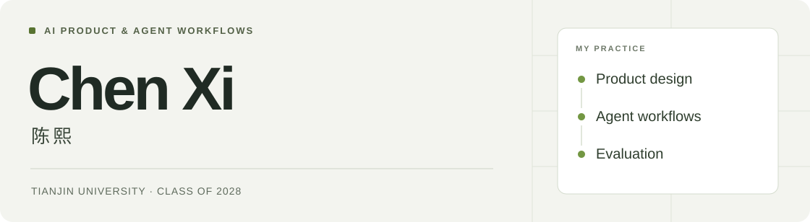
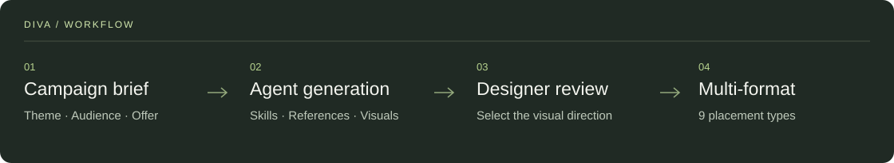

<picture>
  <source media="(prefers-color-scheme: dark)" srcset="assets/header-dark.svg" />
  <source media="(prefers-color-scheme: light)" srcset="assets/header-light.svg" />
  
</picture>

### 你好，我是陈熙。

天津大学本科在读，2028 届。关注 **AI 产品、Agent 工作流与多模态内容生成**，有滴滴和第四范式的 AI 产品实习经历。

我从实际使用场景出发，做需求分析、产品设计、工作流搭建和效果评测，也用 AI Coding 把方案做成可以运行的产品原型。

[代表项目](#代表项目) · [公开作品](#公开作品) · [经历与实践](#经历与实践) · [GitHub](https://github.com/pissyc-pixel?tab=repositories)

## 代表项目

### DIVA · AI 营销素材工作台

**需求分析 / 产品设计 / Agent 工作流 / 上线落地**

面向设计与运营团队的营销素材制作需求，我负责 DIVA 的需求分析、产品设计与 Agent 工作流落地。将活动主题、人群与利益点转为结构化输入，由 Agent 匹配设计 Skill 和历史案例，生成多版主视觉；经设计师确认后，再批量延展不同尺寸素材。

针对中文失真与 Logo 变形，采用 **AI 生成背景、脚本叠加文字与品牌元素**的分层方案。工具已纳入设计团队工作流，支持 **9 类广告位**，应用于 **5 场运营活动**。

### Agent 知乎 · 观点图谱与多 Agent 圆桌

**产品方案 / 角色与 Prompt 设计 / 后端联调**

将已有回答中的观点、立场与依据整理为图谱，并通过多 Agent 圆桌补充不同讨论视角。我负责产品方案、原型与角色设计，参与后端实现和联调，围绕重复表达、偏题与角色一致性迭代讨论规则。

完成可演示 Demo，获 **知乎全球 A2A 黑客松知乎特别奖**。

## 公开作品

<table>
<tr>
<td width="50%" valign="top">

### Native Comms Polisher

**英文沟通与内容本地化 Skill**

把语气自然度、事实保留、承诺程度与平台表达要求整理为可复用的 Codex Skill，包含参考规则与验收案例。

[查看项目与安装说明](https://github.com/pissyc-pixel/native-english)

</td>
<td width="50%" valign="top">

### Freshmanto

**大学生成长模拟 Demo**

用可交互的大学生活模拟探索学业、实习与就业选择。以规则处理行动与结果，由 AI 生成月记和成长回顾。

[查看 Demo、截图与产品文档](https://github.com/pissyc-pixel/freshmanto)

</td>
</tr>
</table>

**Code-Ready** · AI 编程环境桌面工具，围绕工具检测、首次引导与状态展示持续迭代。[查看开发进展](https://github.com/pissyc-pixel/Code-Ready)

## 经历与实践

**滴滴出行 · AI 产品实习**  
负责 DIVA 营销素材工具，以及海外 AI 工具的内容生产与增长实验。搭建趋势采集、卖点匹配、内容生成和合规审核的多 Agent 工作流，通过内容测试迭代生成与分发策略。

**第四范式 · AI 产品实习**  
参与 Agent 内容供给系统的流程设计、工具接入与质量标准建设，配置和运营 Agent 账号，完善内容审核、异常处理与运行复盘。

我习惯先明确用户任务和使用约束，再设计流程、原型与验收条件，最后通过样例评测和数据复盘判断效果。

`Agent 工作流` `Prompt & Skill` `多模态生成` `产品设计` `Python / SQL` `Figma` `Claude Code / Codex`

更多项目资料

以下是我参与的其他项目，链接直达公开案例与作品。

- [AI 内容生产工作流与案例复盘](https://github.com/Xiesy0229/daily-fitness-illustration-workflow)
- [HR-RAG 知识助手：产品方案与学习手册](https://github.com/Xiesy0229/hr-rag-assistant)
- [企业服务产品：PRD 与交互原型](https://github.com/Xiesy0229/prd-portfolio-public)
- [Triple 健身服务三端系统](https://github.com/Xiesy0229/triple-product-system)

---

陈熙 · Chen Xi · AI Product & Agent Workflows
