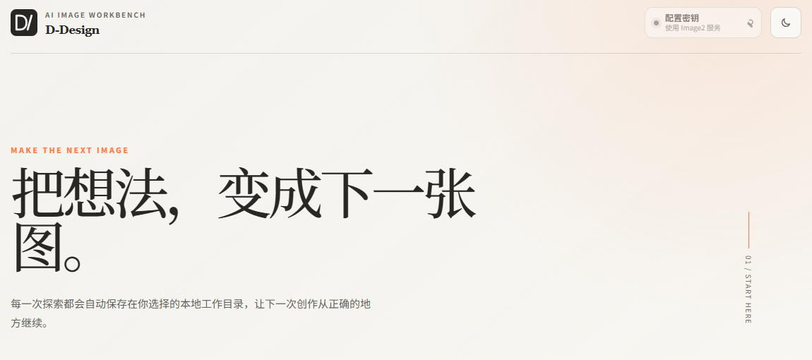

[← 返回个人主页](https://github.com/pissyc-pixel) &nbsp; · &nbsp; [打开 DIVA / D-Design ↗](https://kv.ccxixi.top/)

# DIVA / D-Design

**AI 营销素材工作台**

在滴滴 AI 产品实习期间，我负责 DIVA 的需求分析、产品设计、Agent 工作流搭建与上线落地，服务设计与运营团队的营销素材制作。

## 要解决的问题

运营活动需要持续探索主视觉，并适配 Banner、弹窗等不同广告位。设计团队既要处理重复制作，也要确保文字、Logo、品牌风格与版式一致。单次生图不能覆盖从需求输入到素材交付的完整过程。

我将工作台围绕三件事组织：明确活动需求、保留设计师对主视觉的判断、把确认后的方向延展为不同规格的素材。

## 我负责的工作

- **需求与产品设计**：将活动主题、目标人群和核心利益点整理为结构化输入，梳理主视觉探索、方案选择和多广告位适配流程。
- **Agent 工作流**：匹配设计 Skill 与历史案例，生成多版主视觉；以设计师确认方向为前置环节，再执行多尺寸延展。
- **生成质量与品牌约束**：区分适合生成的背景与需要精确呈现的文字、Logo，通过分层处理和 Skill 约束控制输出。
- **上线与应用**：将工具接入设计团队工作流，支持运营活动中的批量素材制作。

## 关键设计取舍

### 先确认主视觉，再批量适配

多尺寸生成会放大前序视觉选择的影响。工作流将设计师确认放在批量延展之前，让人决定视觉方向，再由工具承担重复的规格适配。

### 分开处理生成内容与精确元素

文字和 Logo 对准确性要求高。采用 AI 生成背景、脚本叠加文字与品牌元素的方案，避免把所有信息一次性交给图像模型。品牌风格和版式要求沉淀为可复用 Skill。

### 把需求转成可以复用的流程

Agent 根据结构化需求匹配 Skill 与案例，再生成候选主视觉。这样，需求输入、生成、审核和尺寸适配各有明确步骤，便于设计师选择和后续迭代。

## 应用结果

工具已纳入设计团队标准工作流，支持 **9 类广告位**的素材适配，累计应用于 **5 场运营活动**。

## 公开体验

[打开 D-Design](https://kv.ccxixi.top/)。公开版首次使用需选择本地工作目录，生成图片需配置生图服务。

---

陈熙 · 产品设计与 Agent 工作流实践
